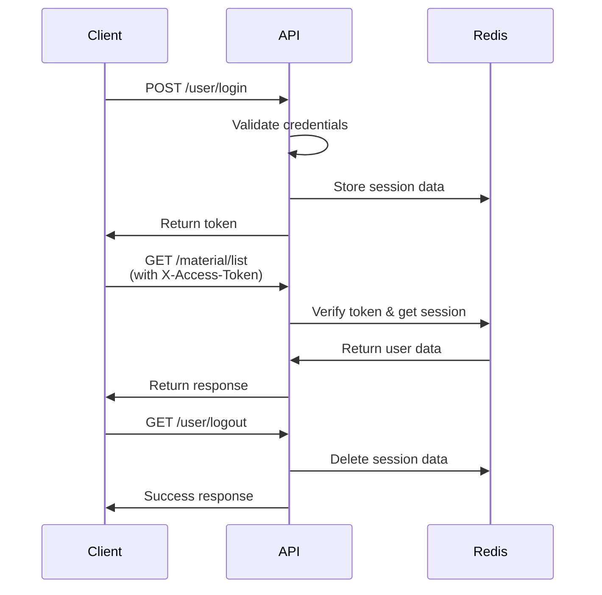

## Overview

jshERP uses a **token-based authentication system** with Redis-backed session management. After successful login, users receive an access token that must be included in all subsequent API requests.

## Authentication Flow



## Login

### Standard Login

Authenticate with username and password:

**Endpoint:** `POST /user/login`

**Request Body:**
```json
{
  "loginName": "admin",
  "password": "hashed_password",
  "code": "1234",
  "uuid": "captcha-uuid-here"
}
```

**Parameters:**
- `loginName` (string, required) - User's login name
- `password` (string, required) - MD5 hashed password
- `code` (string, required) - Verification code from captcha
- `uuid` (string, required) - UUID from captcha request

<Note>
Passwords should be MD5 hashed on the client side before sending to the API.
</Note>

**Success Response:**
```json
{
  "code": 200,
  "data": {
    "token": "your-access-token",
    "user": {
      "id": 1,
      "username": "Administrator",
      "loginName": "admin",
      "tenantId": 1
    }
  }
}
```

**Example:**

<CodeGroup>

```bash cURL
curl -X POST "http://localhost:9999/jshERP-boot/user/login" \
  -H "Content-Type: application/json" \
  -d '{
    "loginName": "admin",
    "password": "5f4dcc3b5aa765d61d8327deb882cf99",
    "code": "1234",
    "uuid": "abc-123-def-456"
  }'
```

```javascript JavaScript
const response = await fetch('http://localhost:9999/jshERP-boot/user/login', {
  method: 'POST',
  headers: {
    'Content-Type': 'application/json'
  },
  body: JSON.stringify({
    loginName: 'admin',
    password: md5('password'), // Hash the password
    code: '1234',
    uuid: captchaUuid
  })
});

const data = await response.json();
const token = data.data.token;
```

```python Python
import requests
import hashlib

password_hash = hashlib.md5('password'.encode()).hexdigest()

response = requests.post(
    'http://localhost:9999/jshERP-boot/user/login',
    json={
        'loginName': 'admin',
        'password': password_hash,
        'code': '1234',
        'uuid': 'abc-123-def-456'
    }
)

data = response.json()
token = data['data']['token']
```

</CodeGroup>

### WeChat Login

Authenticate using WeChat OAuth:

**Endpoint:** `POST /user/weixinLogin`

**Request Body:**
```json
{
  "weixinCode": "user-weixin-code"
}
```

**Response Codes:**
- `200` - Login successful
- `501` - WeChat account not bound to any user
- `500` - Login failed

<Info>
Users must first bind their WeChat account to their jshERP account using the `/user/weixinBind` endpoint.
</Info>

## Captcha Verification

### Get Captcha

Before logging in, obtain a captcha image:

**Endpoint:** `GET /user/randomImage`

**Response:**
```json
{
  "code": 200,
  "data": {
    "uuid": "abc-123-def-456",
    "base64": "data:image/png;base64,iVBORw0KG..."
  }
}
```

**Usage Flow:**

1. Request captcha image
2. Display image to user
3. User enters the code they see
4. Submit code and uuid with login request

<CodeGroup>

```javascript Get Captcha
const getCaptcha = async () => {
  const response = await fetch('http://localhost:9999/jshERP-boot/user/randomImage');
  const data = await response.json();
  
  return {
    uuid: data.data.uuid,
    imageBase64: data.data.base64
  };
};
```

```python Get Captcha
import requests

def get_captcha():
    response = requests.get('http://localhost:9999/jshERP-boot/user/randomImage')
    data = response.json()
    
    return {
        'uuid': data['data']['uuid'],
        'image_base64': data['data']['base64']
    }
```

</CodeGroup>

## Using Authentication Token

After successful login, include the token in all API requests:

### Request Header

```
X-Access-Token: your-access-token-here
```

### Example Authenticated Request

<CodeGroup>

```bash cURL
curl -X GET "http://localhost:9999/jshERP-boot/material/list" \
  -H "X-Access-Token: your-access-token-here"
```

```javascript JavaScript
const response = await fetch('http://localhost:9999/jshERP-boot/material/list', {
  headers: {
    'X-Access-Token': token
  }
});
```

```python Python
import requests

headers = {
    'X-Access-Token': token
}

response = requests.get(
    'http://localhost:9999/jshERP-boot/material/list',
    headers=headers
)
```

</CodeGroup>

## Session Management

### Session Storage

Session data is stored in **Redis** with the following characteristics:

- **Storage Key:** The access token itself
- **Storage Type:** Redis Hash
- **Timeout:** 36000 seconds (10 hours)
- **Auto-renewal:** Each authenticated request extends the session

**Session Data:**
- `userId` - Current user's ID
- `clientIp` - Client IP address
- Additional user context as needed

### Get Current User Session

**Endpoint:** `GET /user/getUserSession`

**Response:**
```json
{
  "code": 200,
  "data": {
    "user": {
      "id": 1,
      "loginName": "admin",
      "username": "Administrator",
      "tenantId": 1,
      "email": "admin@example.com",
      "status": 1
    }
  }
}
```

<Warning>
The password field is always excluded from user session responses for security.
</Warning>

## Logout

End the user session and invalidate the token:

**Endpoint:** `GET /user/logout`

**Response:**
```json
{
  "code": 200,
  "data": null
}
```

**What happens on logout:**
1. Redis session data is deleted (`userId` removed)
2. Client IP information is cleared
3. Token becomes invalid immediately

<CodeGroup>

```javascript Logout Example
const logout = async (token) => {
  await fetch('http://localhost:9999/jshERP-boot/user/logout', {
    headers: {
      'X-Access-Token': token
    }
  });
  
  // Clear local token storage
  localStorage.removeItem('token');
};
```

```python Logout Example
import requests

def logout(token):
    headers = {'X-Access-Token': token}
    requests.get(
        'http://localhost:9999/jshERP-boot/user/logout',
        headers=headers
    )
    # Clear token from storage
```

</CodeGroup>

## Access Control

### Public Endpoints (No Authentication Required)

These endpoints can be accessed without authentication:

- `POST /user/login` - User login
- `POST /user/registerUser` - User registration
- `POST /user/weixinLogin` - WeChat login
- `POST /user/weixinBind` - Bind WeChat account
- `GET /user/randomImage` - Get captcha image
- `GET /doc.html` - Swagger documentation
- Platform and system config endpoints (for initial setup)

### Protected Endpoints

**All other endpoints require authentication.** Requests without a valid token will receive:

```json
{
  "code": 500,
  "data": "loginOut"
```

**HTTP Status:** `500`

### Path Traversal Protection

<Warning>
The API includes security filters that block requests containing path traversal patterns (`..`, `%2e`, `%2E`).
</Warning>

Attempts to use path traversal will result in:
```json
{
  "code": 500,
  "data": "loginOut"
}
```

## User Registration

New users can register through the API:

**Endpoint:** `POST /user/registerUser`

**Request Body:**
```json
{
  "loginName": "newuser",
  "username": "newuser",
  "password": "hashed_password",
  "email": "user@example.com",
  "code": "1234",
  "uuid": "captcha-uuid"
}
```

**Response:**
```json
{
  "code": 200,
  "data": {
    "code": "S0000",
    "message": "操作成功"
  }
}
```

<Info>
New users are automatically assigned to a tenant and given the default role. Tenant limits apply to the number of users that can be created.
</Info>

## Password Management

### Update Password (Authenticated User)

**Endpoint:** `PUT /user/updatePwd`

**Request Body:**
```json
{
  "userId": 1,
  "oldpassword": "old_hashed_password",
  "password": "new_hashed_password"
}
```

**Response Status Values:**
- `1` - Password updated successfully
- `2` - Original password is incorrect
- `3` - Exception occurred during update

### Reset Password (Admin)

**Endpoint:** `POST /user/resetPwd`

**Request Body:**
```json
{
  "id": 5,
  "password": "new_hashed_password"
}
```

<Warning>
Resetting passwords requires appropriate admin permissions.
</Warning>

## Role-Based Access Control

### Get Current User Role Type

**Endpoint:** `GET /user/getRoleTypeByCurrentUser`

**Response:**
```json
{
  "code": 200,
  "data": {
    "roleType": "admin"
  }
}
```

### Get Current User Button Permissions

**Endpoint:** `GET /user/getUserBtnByCurrentUser`

**Response:**
```json
{
  "code": 200,
  "data": {
    "userBtn": [
      "material_add",
      "material_edit",
      "material_delete",
      "depot_view"
    ]
  }
}
```

<Info>
The admin user automatically has all permissions and doesn't need button permission checks.
</Info>

## Multi-Tenant Considerations

### Tenant Information

Get current user's tenant details:

**Endpoint:** `GET /user/infoWithTenant`

**Response:**
```json
{
  "code": 200,
  "data": {
    "type": 1,
    "expireTime": "2025-12-31 23:59:59",
    "userCurrentNum": 25,
    "userNumLimit": 1000000,
    "tenantId": 1
  }
}
```

**Fields:**
- `type` - Tenant type (0: free, 1: paid)
- `expireTime` - Tenant expiration date
- `userCurrentNum` - Current number of users
- `userNumLimit` - Maximum allowed users
- `tenantId` - Tenant identifier

<Warning>
If a tenant has expired, the session will be automatically terminated on the next request, and the user will need to log in again.
</Warning>

## Security Best Practices

1. **Always hash passwords** using MD5 before sending to the API
2. **Store tokens securely** using secure storage mechanisms
3. **Implement token refresh** logic before session expiration
4. **Clear tokens on logout** from client-side storage
5. **Handle session expiration** gracefully with automatic re-login
6. **Validate captcha** on every login attempt
7. **Use HTTPS** in production environments
8. **Implement rate limiting** on the client side for login attempts
9. **Monitor failed login attempts** for security purposes
10. **Never log or expose** authentication tokens

## Error Handling

### Common Authentication Errors

**Invalid Credentials:**
```json
{
  "code": 500,
  "data": "用户登录失败"
}
```

**Session Expired:**
```json
{
  "code": 500,
  "data": "loginOut"
}
```

**Invalid Captcha:**
Thrown as `BusinessRunTimeException` with specific error code.

**Tenant Expired:**
Session automatically cleared, next request returns `loginOut`.

## Example: Complete Authentication Flow

<CodeGroup>

```javascript Complete Flow
class JshERPAuth {
  constructor(baseUrl) {
    this.baseUrl = baseUrl;
    this.token = localStorage.getItem('token');
  }
  
  async getCaptcha() {
    const response = await fetch(`${this.baseUrl}/user/randomImage`);
    const data = await response.json();
    return data.data;
  }
  
  async login(loginName, password, code, uuid) {
    const response = await fetch(`${this.baseUrl}/user/login`, {
      method: 'POST',
      headers: { 'Content-Type': 'application/json' },
      body: JSON.stringify({
        loginName,
        password: md5(password),
        code,
        uuid
      })
    });
    
    const data = await response.json();
    if (data.code === 200) {
      this.token = data.data.token;
      localStorage.setItem('token', this.token);
      return data.data;
    }
    throw new Error(data.data);
  }
  
  async request(endpoint, options = {}) {
    const response = await fetch(`${this.baseUrl}${endpoint}`, {
      ...options,
      headers: {
        ...options.headers,
        'X-Access-Token': this.token
      }
    });
    
    const data = await response.json();
    
    // Handle session expiration
    if (data.code === 500 && data.data === 'loginOut') {
      this.logout();
      throw new Error('Session expired');
    }
    
    return data;
  }
  
  async logout() {
    try {
      await this.request('/user/logout');
    } finally {
      this.token = null;
      localStorage.removeItem('token');
    }
  }
}

// Usage
const auth = new JshERPAuth('http://localhost:9999/jshERP-boot');

// Get captcha
const captcha = await auth.getCaptcha();

// Show captcha to user and get input
const userCode = prompt('Enter captcha code');

// Login
const userData = await auth.login('admin', 'password', userCode, captcha.uuid);

// Make authenticated requests
const materials = await auth.request('/material/list');
```

</CodeGroup>

## Next Steps

<CardGroup cols={2}>
  <Card title="API Introduction" icon="book" href="/api/introduction">
    Learn about API structure and common patterns
  </Card>
  <Card title="User Management" icon="users" href="/api/user">
    Explore user management endpoints
  </Card>
</CardGroup>