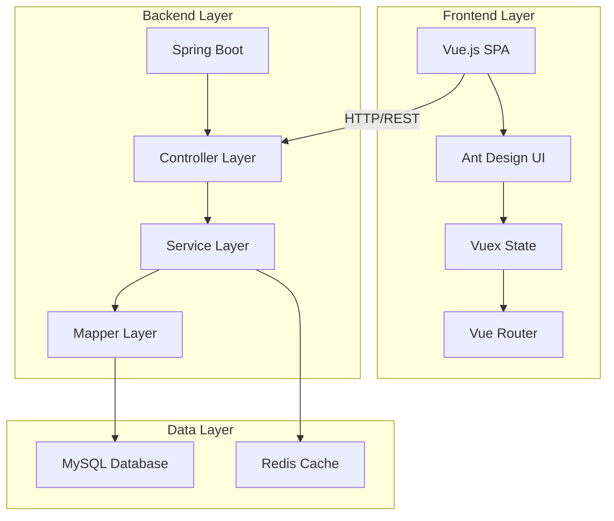

## Overview

jshERP is built on a modern, scalable architecture that separates concerns between frontend and backend, enabling easy maintenance and extensibility.

<Note>
The system follows a three-tier architecture pattern with clear separation between presentation, business logic, and data layers.
</Note>

## Technology Stack

### Backend Technologies

The backend is built with **Spring Boot 2.0.0** and uses industry-standard Java technologies:

- **Framework**: Spring Boot 2.0.0.RELEASE
- **Language**: Java 1.8
- **Build Tool**: Maven
- **ORM**: MyBatis Plus 3.0.7.1 with PageHelper
- **Database**: MySQL 8.0+ with JDBC driver 8.0.33
- **Cache**: Redis
- **API Documentation**: Swagger 2.7.0 with swagger-bootstrap-ui
- **Plugin System**: springboot-plugin-framework 2.2.1
- **JSON Processing**: FastJSON 1.2.83
- **Logging**: SLF4J with Log4j2 2.15.0

```xml title="pom.xml"
<parent>
    <groupId>org.springframework.boot</groupId>
    <artifactId>spring-boot-starter-parent</artifactId>
    <version>2.0.0.RELEASE</version>
</parent>

<properties>
    <project.build.sourceEncoding>UTF-8</project.build.sourceEncoding>
    <java.version>1.8</java.version>
</properties>
```

### Frontend Technologies

The frontend is a modern Vue.js single-page application:

- **Framework**: Vue.js 2.7.16
- **UI Library**: Ant Design Vue 1.5.2
- **State Management**: Vuex 3.1.0
- **Routing**: Vue Router 3.0.1
- **HTTP Client**: Axios 0.18.0
- **Build Tool**: Vue CLI 3.3.0
- **Charts**: Viser-vue 2.4.4
- **Internationalization**: Vue-i18n 8.7.0

```json title="package.json"
{
  "name": "jsh-erp-web",
  "version": "3.5.0",
  "dependencies": {
    "vue": "^2.7.16",
    "ant-design-vue": "1.5.2",
    "vuex": "^3.1.0",
    "vue-router": "^3.0.1",
    "axios": "^0.18.0"
  }
}
```

## System Architecture

### Three-Tier Architecture



### Application Entry Points

<CodeGroup>

```java title="ErpApplication.java" {16,18-19}
package com.jsh.erp;

import org.mybatis.spring.annotation.MapperScan;
import org.springframework.boot.SpringApplication;
import org.springframework.boot.autoconfigure.SpringBootApplication;
import org.springframework.boot.web.servlet.ServletComponentScan;
import org.springframework.scheduling.annotation.EnableAsync;
import org.springframework.scheduling.annotation.EnableScheduling;

@SpringBootApplication
@MapperScan("com.jsh.erp.datasource.mappers")
@ServletComponentScan
@EnableScheduling
@EnableAsync
public class ErpApplication {
    public static void main(String[] args) {
        SpringApplication.run(ErpApplication.class, args);
    }
}
```

```javascript title="main.js"
import Vue from 'vue'
import App from './App.vue'
import router from './router'
import store from './store/'
import Antd from 'ant-design-vue'
import { VueAxios } from "@/utils/request"

Vue.use(Antd)
Vue.use(VueAxios, router)

new Vue({
  router,
  store,
  render: h => h(App)
}).$mount('#app')
```

</CodeGroup>

## Backend Architecture

### Package Structure

The backend follows a modular package structure:

```
com.jsh.erp/
├── ErpApplication.java          # Application entry point
├── base/                        # Base classes and utilities
├── config/                      # Configuration classes
│   ├── PluginConfiguration.java # Plugin system config
│   ├── PluginBeanConfig.java
│   ├── Swagger2Config.java      # API documentation
│   └── TenantConfig.java        # Multi-tenancy config
├── constants/                   # Application constants
├── controller/                  # REST API endpoints
│   ├── AccountController.java
│   ├── DepotController.java
│   ├── MaterialController.java
│   └── PluginController.java
├── datasource/                  # Data layer
│   ├── entities/               # Entity classes (263 files)
│   ├── mappers/                # MyBatis mappers
│   └── vo/                     # Value objects
├── exception/                   # Exception handling
├── filter/                      # Request filters
├── service/                     # Business logic layer
│   ├── AccountService.java
│   ├── DepotService.java
│   ├── MaterialService.java
│   └── ...
└── utils/                       # Utility classes
```

### Controller Layer

Controllers handle HTTP requests and delegate to services:

```java title="AccountController.java"
@RestController
@RequestMapping("/account")
@Api(tags = {"账户管理"})
public class AccountController {
    
    @Resource
    private AccountService accountService;
    
    @PostMapping("/add")
    @ApiOperation(value = "新增账户")
    public BaseResponseInfo addAccount(@RequestBody Account account) {
        BaseResponseInfo res = new BaseResponseInfo();
        try {
            accountService.addAccount(account);
            res.code = 200;
            res.data = "添加成功";
        } catch (Exception e) {
            res.code = 500;
            res.data = "添加失败";
        }
        return res;
    }
}
```

### Service Layer

Services contain business logic and transaction management:

- **AccountService**: Account and financial management
- **DepotService**: Warehouse operations
- **MaterialService**: Product/inventory management
- **DepotHeadService**: Document header processing
- **DepotItemService**: Document detail processing

### Data Access Layer

MyBatis Plus provides ORM capabilities with custom XML mappers:

```xml title="application.properties"
mybatis-plus.mapper-locations=classpath:./mapper_xml/*.xml
```

<Warning>
The system uses MyBatis Plus 3.0.7.1 which requires Java 8 or higher.
</Warning>

## Frontend Architecture

### Directory Structure

```
src/
├── api/                    # API service modules
├── assets/                 # Static assets (images, styles)
│   └── less/              # LESS stylesheets
├── components/            # Reusable Vue components
│   ├── jeecg/            # Custom component library
│   ├── jeecgbiz/         # Business components
│   └── chart/            # Chart components
├── config/                # Frontend configuration
├── mixins/                # Vue mixins
├── router/                # Vue Router configuration
├── store/                 # Vuex state management
├── utils/                 # Utility functions
├── views/                 # Page components
│   ├── bill/             # Document management
│   ├── dashboard/        # Dashboard views
│   ├── financial/        # Financial management
│   ├── material/         # Product management
│   ├── report/           # Reports
│   ├── system/           # System management
│   └── user/             # User management
├── App.vue               # Root component
├── main.js               # Application entry
└── permission.js         # Route permission control
```

### State Management

Vuex manages application state with modules:

- **user**: User authentication and profile
- **permission**: Dynamic route permissions
- **app**: Application-wide settings

### API Integration

Axios is configured with interceptors for authentication:

```javascript title="utils/request.js"
import axios from 'axios'
import { VueAxios } from './axios'

const service = axios.create({
  baseURL: '/jshERP-boot',
  timeout: 10000
})

// Request interceptor
service.interceptors.request.use(
  config => {
    const token = localStorage.getItem('Access-Token')
    if (token) {
      config.headers['X-Access-Token'] = token
    }
    return config
  },
  error => Promise.reject(error)
)
```

## Multi-Tenancy Support

The system includes built-in multi-tenancy support:

<Steps>

### Tenant Isolation

Each database table includes a `tenant_id` field for data isolation.

### Configuration

```properties title="application.properties"
# Tenant role ID
manage.roleId=10
# Maximum users per tenant
tenant.userNumLimit=1000000
# Trial period (days)
tenant.tryDayLimit=3000
```

### Implementation

The `TenantConfig.java` class provides tenant context and isolation logic.

</Steps>

## API Documentation

Swagger UI is available at runtime for API exploration:

```java title="Swagger2Config.java"
@Configuration
@EnableSwagger2
public class Swagger2Config {
    @Bean
    public Docket createRestApi() {
        return new Docket(DocumentationType.SWAGGER_2)
                .apiInfo(apiInfo())
                .select()
                .apis(RequestHandlerSelectors.basePackage("com.jsh.erp.controller"))
                .paths(PathSelectors.any())
                .build();
    }
}
```

**Access URL**: `http://localhost:9999/jshERP-boot/doc.html`

## Key Design Patterns

### MVC Pattern
- **Model**: Entity classes and MyBatis mappers
- **View**: Vue.js components
- **Controller**: Spring REST controllers

### Service Layer Pattern
Business logic is encapsulated in service classes for reusability.

### Repository Pattern
MyBatis mappers abstract database access.

### Plugin Pattern
Extensible plugin system using springboot-plugin-framework.

## Performance Considerations

<Note>
The system includes several performance optimizations:
- **Redis caching** for frequently accessed data
- **Connection pooling** for database connections
- **Batch operations** with rewriteBatchedStatements=true
- **Lazy loading** with useCursorFetch=true
</Note>

```properties title="application.properties"
spring.datasource.url=jdbc:mysql://127.0.0.1:3306/jsh_erp?useUnicode=true&characterEncoding=utf8&useCursorFetch=true&defaultFetchSize=500&allowMultiQueries=true&rewriteBatchedStatements=true

spring.redis.host=127.0.0.1
spring.redis.port=6379
```

## Security Features

- **Session management**: 10-hour session timeout
- **Token-based authentication**: X-Access-Token header
- **Role-based access control**: Function-level permissions
- **Multi-tenancy**: Tenant-level data isolation
- **SQL injection prevention**: MyBatis parameterized queries

## Related Resources

- [Database Schema](/development/database-schema) - Database structure details
- [Plugin System](/development/plugin-system) - Extending functionality
- [Customization Guide](/development/customization) - Customizing jshERP
