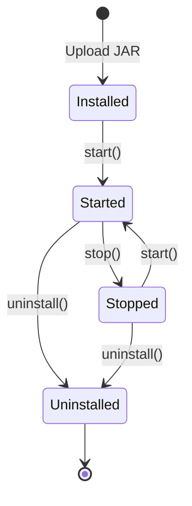

## Overview

jshERP includes a powerful plugin system based on **springboot-plugin-framework 2.2.1**, allowing you to extend functionality without modifying core code.

<Note>
The plugin system supports hot deployment, meaning plugins can be installed, started, stopped, and uninstalled at runtime without restarting the application.
</Note>

## Plugin Framework

### Core Dependencies

```xml title="pom.xml"
<dependency>
    <groupId>com.gitee.starblues</groupId>
    <artifactId>springboot-plugin-framework</artifactId>
    <version>2.2.1-RELEASE</version>
</dependency>
<dependency>
    <groupId>com.gitee.starblues</groupId>
    <artifactId>springboot-plugin-framework-extension-mybatis</artifactId>
    <version>2.2.1-RELEASE</version>
</dependency>
```

### Plugin Configuration

```java title="PluginConfiguration.java" {19-20,27-28,30-34}
package com.jsh.erp.config;

import com.gitee.starblues.integration.DefaultIntegrationConfiguration;
import org.pf4j.RuntimeMode;
import org.springframework.beans.factory.annotation.Value;
import org.springframework.boot.context.properties.ConfigurationProperties;
import org.springframework.stereotype.Component;

@Component
@ConfigurationProperties(prefix = "plugin")
public class PluginConfiguration extends DefaultIntegrationConfiguration {

    /**
     * 运行模式
     * 开发环境: development、dev
     * 生产/部署 环境: deployment、prod
     */
    @Value("${runMode:dev}")
    private String runMode;

    @Value("${pluginPath:plugins}")
    private String pluginPath;

    @Value("${pluginConfigFilePath:pluginConfigs}")
    private String pluginConfigFilePath;

    @Override
    public RuntimeMode environment() {
        return RuntimeMode.byName(runMode);
    }

    @Override
    public String pluginPath() {
        return pluginPath;
    }

    @Override
    public String pluginConfigFilePath() {
        return pluginConfigFilePath;
    }

    @Override
    public String uploadTempPath() {
        return "temp";
    }

    @Override
    public String backupPath() {
        return "backupPlugin";
    }

    @Override
    public String pluginRestControllerPathPrefix() {
        return "/api/plugin";
    }

    @Override
    public boolean enablePluginIdRestControllerPathPrefix() {
        return true;
    }
}
```

### Application Properties

```properties title="application.properties"
# Plugin configuration
plugin.runMode=prod
plugin.pluginPath=plugins
plugin.pluginConfigFilePath=pluginConfig
```

**Configuration Options**:

- **runMode**: `dev` (development) or `prod` (production)
- **pluginPath**: Directory where plugin JAR files are stored
- **pluginConfigFilePath**: Directory for plugin configuration files

### Plugin Bean Configuration

```java title="PluginBeanConfig.java"
package com.jsh.erp.config;

import com.gitee.starblues.extension.mybatis.SpringBootMybatisExtension;
import com.gitee.starblues.integration.application.AutoPluginApplication;
import com.gitee.starblues.integration.application.PluginApplication;
import org.springframework.context.annotation.Bean;
import org.springframework.context.annotation.Configuration;

@Configuration
public class PluginBeanConfig {
    @Bean
    public PluginApplication pluginApplication(){
        PluginApplication pluginApplication = new AutoPluginApplication();
        // Add MyBatis support for plugins
        pluginApplication.addExtension(new SpringBootMybatisExtension());
        return pluginApplication;
    }
}
```

<Warning>
The `SpringBootMybatisExtension` is crucial for plugins that need database access. Without it, plugin MyBatis mappers won't be registered.
</Warning>

## Plugin Management API

The system provides REST APIs for plugin management:

### List Plugins

```java title="PluginController.java:51"
@GetMapping(value = "/list")
@ApiOperation(value = "获取插件信息")
public BaseResponseInfo getPluginInfo(
    @RequestParam(value = "name", required = false) String name,
    @RequestParam("currentPage") Integer currentPage,
    @RequestParam("pageSize") Integer pageSize,
    HttpServletRequest request) throws Exception {
    
    BaseResponseInfo res = new BaseResponseInfo();
    List<PluginInfo> resList = new ArrayList<>();
    
    User userInfo = userService.getCurrentUser();
    if(BusinessConstants.DEFAULT_MANAGER.equals(userInfo.getLoginName())) {
        List<PluginInfo> list = pluginOperator.getPluginInfo();
        // Filter by name if provided
        if (StringUtil.isEmpty(name)) {
            resList = list;
        } else {
            for (PluginInfo pi : list) {
                String desc = pi.getPluginDescriptor().getPluginDescription();
                if (desc.contains(name)) {
                    resList.add(pi);
                }
            }
        }
    }
    
    res.code = 200;
    res.data = resList;
    return res;
}
```

**Endpoint**: `GET /plugin/list?name=&currentPage=1&pageSize=10`

### Start Plugin

```java title="PluginController.java:147"
@PostMapping("/start/{id}")
@ApiOperation(value = "根据插件id启动插件")
public BaseResponseInfo start(@PathVariable("id") String id) {
    BaseResponseInfo res = new BaseResponseInfo();
    String message = "";
    
    try {
        User userInfo = userService.getCurrentUser();
        if(BusinessConstants.DEFAULT_MANAGER.equals(userInfo.getLoginName())) {
            if (pluginOperator.start(id)) {
                message = "plugin '" + id + "' start success";
            } else {
                message = "plugin '" + id + "' start failure";
            }
        } else {
            message = "power is limit";
        }
        res.code = 200;
        res.data = message;
    } catch (Exception e) {
        res.code = 500;
        res.data = "plugin '" + id +"' start failure. " + e.getMessage();
    }
    
    return res;
}
```

**Endpoint**: `POST /plugin/start/{pluginId}`

### Stop Plugin

```java title="PluginController.java:113"
@PostMapping("/stop/{id}")
@ApiOperation(value = "根据插件id停止插件")
public BaseResponseInfo stop(@PathVariable("id") String id) {
    // Similar implementation to start()
    if (pluginOperator.stop(id)) {
        // Plugin stopped successfully
    }
    return res;
}
```

**Endpoint**: `POST /plugin/stop/{pluginId}`

### Install Plugin

```java title="PluginController.java:243"
@PostMapping("/uploadInstallPluginJar")
@ApiOperation(value = "上传并安装插件")
public BaseResponseInfo install(
    MultipartFile file,
    HttpServletRequest request,
    HttpServletResponse response) {
    
    BaseResponseInfo res = new BaseResponseInfo();
    try {
        User userInfo = userService.getCurrentUser();
        if(BusinessConstants.DEFAULT_MANAGER.equals(userInfo.getLoginName())) {
            pluginOperator.uploadPluginAndStart(file);
            res.code = 200;
            res.data = "导入成功";
        } else {
            res.code = 500;
            res.data = "抱歉，无操作权限！";
        }
    } catch(Exception e) {
        res.code = 500;
        res.data = "导入失败";
    }
    return res;
}
```

**Endpoint**: `POST /plugin/uploadInstallPluginJar`

### Uninstall Plugin

```java title="PluginController.java:182"
@PostMapping("/uninstall/{id}")
@ApiOperation(value = "根据插件id卸载插件")
public BaseResponseInfo uninstall(@PathVariable("id") String id) {
    if (pluginOperator.uninstall(id, true)) {
        message = "plugin '" + id + "' uninstall success";
    }
    return res;
}
```

**Endpoint**: `POST /plugin/uninstall/{pluginId}`

### Check Plugin Existence

```java title="PluginController.java:341"
@GetMapping("/checkByPluginId")
@ApiOperation(value = "根据插件标识判断是否存在")
public BaseResponseInfo checkByTag(@RequestParam("pluginIds") String pluginIds) {
    BaseResponseInfo res = new BaseResponseInfo();
    boolean data = false;
    
    if(StringUtil.isNotEmpty(pluginIds)) {
        String[] pluginIdList = pluginIds.split(",");
        List<PluginInfo> list = pluginOperator.getPluginInfo();
        
        for (PluginInfo pi : list) {
            String info = pi.getPluginDescriptor().getPluginId();
            for (int i = 0; i < pluginIdList.length; i++) {
                if (pluginIdList[i].equals(info)) {
                    data = true;
                }
            }
        }
    }
    
    res.code = 200;
    res.data = data;
    return res;
}
```

**Endpoint**: `GET /plugin/checkByPluginId?pluginIds=plugin1,plugin2`

<Note>
All plugin management operations require **admin privileges** (user with login name matching `DEFAULT_MANAGER`).
</Note>

## Creating a Plugin

### Plugin Project Structure

<Steps>

### Create Maven Project

```xml title="pom.xml"
<?xml version="1.0" encoding="UTF-8"?>
<project xmlns="http://maven.apache.org/POM/4.0.0"
         xmlns:xsi="http://www.w3.org/2001/XMLSchema-instance"
         xsi:schemaLocation="http://maven.apache.org/POM/4.0.0
         http://maven.apache.org/xsd/maven-4.0.0.xsd">
    <modelVersion>4.0.0</modelVersion>

    <groupId>com.jsh.erp.plugin</groupId>
    <artifactId>demo-plugin</artifactId>
    <version>1.0.0</version>
    <packaging>jar</packaging>

    <dependencies>
        <!-- Plugin framework -->
        <dependency>
            <groupId>com.gitee.starblues</groupId>
            <artifactId>springboot-plugin-framework</artifactId>
            <version>2.2.1-RELEASE</version>
            <scope>provided</scope>
        </dependency>
        
        <!-- Spring Boot (provided by host) -->
        <dependency>
            <groupId>org.springframework.boot</groupId>
            <artifactId>spring-boot-starter-web</artifactId>
            <version>2.0.0.RELEASE</version>
            <scope>provided</scope>
        </dependency>
    </dependencies>

    <build>
        <plugins>
            <plugin>
                <groupId>org.apache.maven.plugins</groupId>
                <artifactId>maven-jar-plugin</artifactId>
                <version>3.1.0</version>
                <configuration>
                    <archive>
                        <manifestEntries>
                            <Plugin-Class>com.jsh.erp.plugin.DemoPlugin</Plugin-Class>
                            <Plugin-Id>demo-plugin</Plugin-Id>
                            <Plugin-Version>1.0.0</Plugin-Version>
                            <Plugin-Provider>Your Company</Plugin-Provider>
                            <Plugin-Description>Demo Plugin for jshERP</Plugin-Description>
                        </manifestEntries>
                    </archive>
                </configuration>
            </plugin>
        </plugins>
    </build>
</project>
```

### Create Plugin Main Class

```java title="DemoPlugin.java"
package com.jsh.erp.plugin;

import com.gitee.starblues.annotation.AutowiredType;
import com.gitee.starblues.realize.BasePlugin;
import org.pf4j.PluginWrapper;
import org.springframework.stereotype.Component;

/**
 * Plugin main class
 */
public class DemoPlugin extends BasePlugin {

    public DemoPlugin(PluginWrapper wrapper) {
        super(wrapper);
    }

    @Override
    protected void startEvent() {
        System.out.println("Demo Plugin started!");
    }

    @Override
    protected void stopEvent() {
        System.out.println("Demo Plugin stopped!");
    }

    @Override
    protected void deleteEvent() {
        System.out.println("Demo Plugin deleted!");
    }
}
```

### Create REST Controller

```java title="DemoController.java"
package com.jsh.erp.plugin.controller;

import com.gitee.starblues.annotation.AutowiredType;
import com.gitee.starblues.annotation.ConfigDefinition;
import org.springframework.web.bind.annotation.GetMapping;
import org.springframework.web.bind.annotation.RequestMapping;
import org.springframework.web.bind.annotation.RestController;

@RestController
@RequestMapping("/demo")
@ConfigDefinition
public class DemoController {

    @GetMapping("/hello")
    public String hello() {
        return "Hello from Demo Plugin!";
    }

    @GetMapping("/version")
    public String version() {
        return "Demo Plugin v1.0.0";
    }
}
```

<Note>
Plugin REST controllers are automatically prefixed with `/api/plugin/{pluginId}/`

For example: `http://localhost:9999/jshERP-boot/api/plugin/demo-plugin/demo/hello`
</Note>

### Add Service Layer (Optional)

```java title="DemoService.java"
package com.jsh.erp.plugin.service;

import com.gitee.starblues.annotation.ConfigDefinition;
import org.springframework.stereotype.Service;

@Service
@ConfigDefinition
public class DemoService {

    public String processData(String input) {
        return "Processed: " + input;
    }
}
```

### Build Plugin

```bash
mvn clean package
```

The plugin JAR will be in `target/demo-plugin-1.0.0.jar`

</Steps>

## Plugin with Database Access

If your plugin needs to access the database:

<Steps>

### Add MyBatis Extension Dependency

```xml title="pom.xml"
<dependency>
    <groupId>com.gitee.starblues</groupId>
    <artifactId>springboot-plugin-framework-extension-mybatis</artifactId>
    <version>2.2.1-RELEASE</version>
    <scope>provided</scope>
</dependency>
```

### Create Entity Class

```java title="DemoEntity.java"
package com.jsh.erp.plugin.entity;

public class DemoEntity {
    private Long id;
    private String name;
    private String data;
    // getters and setters
}
```

### Create MyBatis Mapper

```java title="DemoMapper.java"
package com.jsh.erp.plugin.mapper;

import com.gitee.starblues.annotation.ConfigDefinition;
import com.jsh.erp.plugin.entity.DemoEntity;
import org.apache.ibatis.annotations.Mapper;
import org.apache.ibatis.annotations.Select;
import java.util.List;

@Mapper
@ConfigDefinition
public interface DemoMapper {

    @Select("SELECT * FROM demo_table WHERE tenant_id = #{tenantId}")
    List<DemoEntity> selectByTenantId(Long tenantId);
}
```

### Use Mapper in Service

```java title="DemoService.java"
package com.jsh.erp.plugin.service;

import com.gitee.starblues.annotation.ConfigDefinition;
import com.gitee.starblues.annotation.AutowiredType;
import com.jsh.erp.plugin.mapper.DemoMapper;
import com.jsh.erp.plugin.entity.DemoEntity;
import org.springframework.beans.factory.annotation.Autowired;
import org.springframework.stereotype.Service;
import java.util.List;

@Service
@ConfigDefinition
public class DemoService {

    @Autowired(autowiredType = AutowiredType.PLUGIN_MAIN)
    private DemoMapper demoMapper;

    public List<DemoEntity> getData(Long tenantId) {
        return demoMapper.selectByTenantId(tenantId);
    }
}
```

</Steps>

<Warning>
Always use `@Autowired(autowiredType = AutowiredType.PLUGIN_MAIN)` when injecting plugin beans to ensure proper dependency resolution.
</Warning>

## Plugin Configuration Files

Plugins can have their own configuration files:

### Create plugin.properties

```properties title="src/main/resources/plugin.properties"
# Plugin configuration
demo.feature.enabled=true
demo.api.timeout=5000
demo.cache.size=100
```

### Read Configuration

```java
package com.jsh.erp.plugin.config;

import com.gitee.starblues.annotation.ConfigDefinition;
import org.springframework.beans.factory.annotation.Value;
import org.springframework.stereotype.Component;

@Component
@ConfigDefinition
public class DemoConfig {

    @Value("${demo.feature.enabled:true}")
    private boolean featureEnabled;

    @Value("${demo.api.timeout:5000}")
    private int apiTimeout;

    public boolean isFeatureEnabled() {
        return featureEnabled;
    }

    public int getApiTimeout() {
        return apiTimeout;
    }
}
```

## Deploying Plugins

<CodeGroup>

```bash title="Manual Deployment"
# Copy plugin JAR to plugins directory
cp demo-plugin-1.0.0.jar /opt/jshERP/plugins/

# The plugin will be loaded automatically
# Or restart the application
```

```bash title="API Upload"
curl -X POST http://localhost:9999/jshERP-boot/plugin/uploadInstallPluginJar \
  -H "X-Access-Token: YOUR_TOKEN" \
  -F "file=@demo-plugin-1.0.0.jar"
```

```bash title="Install from Path"
curl -X POST http://localhost:9999/jshERP-boot/plugin/installByPath \
  -H "X-Access-Token: YOUR_TOKEN" \
  -d "path=/opt/plugins/demo-plugin-1.0.0.jar"
```

</CodeGroup>

## Plugin Lifecycle



### Lifecycle Hooks

```java
public class DemoPlugin extends BasePlugin {

    @Override
    protected void startEvent() {
        // Called when plugin starts
        // Initialize resources, connect to external services, etc.
    }

    @Override
    protected void stopEvent() {
        // Called when plugin stops
        // Clean up resources, close connections, etc.
    }

    @Override
    protected void deleteEvent() {
        // Called when plugin is uninstalled
        // Remove data, clean up files, etc.
    }
}
```

## Best Practices

### 1. Use @ConfigDefinition Annotation

Always annotate plugin beans:

```java
@Service
@ConfigDefinition  // Required for plugin beans!
public class MyService {
    // ...
}
```

### 2. Tenant Awareness

Respect multi-tenancy in queries:

```java
@Select("SELECT * FROM my_table WHERE tenant_id = #{tenantId} AND delete_flag = '0'")
List<MyEntity> findByTenantId(Long tenantId);
```

### 3. Soft Delete Pattern

Follow the soft delete pattern:

```java
@Update("UPDATE my_table SET delete_flag = '1' WHERE id = #{id}")
void softDelete(Long id);
```

### 4. Exception Handling

Handle exceptions gracefully:

```java
@GetMapping("/data")
public BaseResponseInfo getData() {
    BaseResponseInfo res = new BaseResponseInfo();
    try {
        res.code = 200;
        res.data = myService.getData();
    } catch (Exception e) {
        logger.error(e.getMessage(), e);
        res.code = 500;
        res.data = "获取数据失败";
    }
    return res;
}
```

### 5. Version Compatibility

Specify compatible host versions:

```xml
<manifestEntries>
    <Plugin-Requires>jshERP-boot>=3.0.0</Plugin-Requires>
</manifestEntries>
```

## Debugging Plugins

### Development Mode

Use development mode for easier debugging:

```properties title="application.properties"
plugin.runMode=dev
plugin.pluginPath=../plugins-dev
```

### Logging

Add logging to track plugin behavior:

```java
import org.slf4j.Logger;
import org.slf4j.LoggerFactory;

public class DemoService {
    private static final Logger logger = LoggerFactory.getLogger(DemoService.class);

    public void processData() {
        logger.info("Processing data...");
        logger.debug("Data details: {}", data);
        logger.error("Error occurred", exception);
    }
}
```

### View Plugin Status

Check plugin status via API:

```bash
curl http://localhost:9999/jshERP-boot/plugin/list?currentPage=1&pageSize=10
```

## Security Considerations

<Warning>
**Important Security Notes**:

1. Only install plugins from **trusted sources**
2. Plugin management requires **admin privileges**
3. Plugins have **full access** to the application context
4. Review plugin code before installation
5. Use **MAC address validation** for licensing
</Warning>

### MAC Address Licensing

The system provides MAC address access:

```java title="PluginController.java:320"
@GetMapping("/getMacWithSecret")
public BaseResponseInfo getMacWithSecret() {
    BaseResponseInfo res = new BaseResponseInfo();
    try {
        String mac = ComputerInfo.getMacAddress();
        res.code = 200;
        res.data = DigestUtils.md5DigestAsHex(mac.getBytes());
    } catch (Exception e) {
        res.code = 500;
        res.data = "获取数据失败";
    }
    return res;
}
```

## Plugin Examples

Common plugin use cases:

- **Payment Integration**: Alipay, WeChat Pay, PayPal
- **Logistics Integration**: Express tracking APIs
- **Reports**: Custom report generators
- **Notifications**: SMS, Email, WeChat notifications
- **Import/Export**: Excel, PDF converters
- **Authentication**: LDAP, OAuth2, SAML

## Troubleshooting

### Plugin Not Loading

1. Check plugin manifest in JAR
2. Verify `Plugin-Class` points to correct class
3. Check logs for errors
4. Ensure plugin path is correct

### Database Access Fails

1. Verify `SpringBootMybatisExtension` is added
2. Check `@ConfigDefinition` on mappers
3. Use correct `AutowiredType.PLUGIN_MAIN`

### API Endpoints Not Working

1. Verify controller path prefix
2. Check `@ConfigDefinition` annotation
3. Ensure plugin is started

## Related Resources

- [System Architecture](/development/architecture) - Core system design
- [Customization Guide](/development/customization) - Other extension methods
- [API Reference](/api/introduction) - Using plugin APIs
