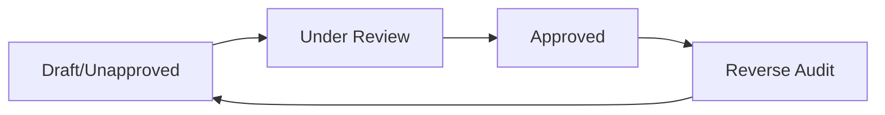

The Financial Management module handles accounting operations including payment processing, receivables collection, account management, and financial reporting.

## Overview

Manage your organization's finances with integrated accounts payable/receivable tracking, payment processing, and reconciliation tools.

<Note>
Financial transactions automatically sync with business operations - purchases, sales, and payments all flow through the financial module.
</Note>

## Module Components

<CardGroup cols={2}>
  <Card title="Payment Out (付款单)" icon="money-bill-transfer">
    Record payments to suppliers and vendors
  </Card>
  <Card title="Collection In (收款单)" icon="hand-holding-dollar">
    Record payments received from customers
  </Card>
  <Card title="Transfer (转账单)" icon="right-left">
    Move funds between your own accounts
  </Card>
  <Card title="Advance Payment (预收款)" icon="piggy-bank">
    Record customer deposits and prepayments
  </Card>
  <Card title="Income/Expense (收支单)" icon="receipt">
    Track other income and expenses
  </Card>
  <Card title="Account Management" icon="building-columns">
    Manage bank accounts, cash, and other financial accounts
  </Card>
</CardGroup>

## Account Management

Set up and manage financial accounts:

### Account Types

- **Bank Accounts**: Company bank accounts for transfers and payments
- **Cash**: Physical cash registers and petty cash
- **Payment Processors**: Credit card merchant accounts, mobile payment accounts
- **Other**: Investment accounts, escrow accounts

### Creating Accounts

**Navigate**: **Financial > Accounts**

**Fields:**
- Account name
- Account number
- Account type
- Initial balance
- Current balance (auto-calculated)
- Bank name and branch
- Serial number (internal tracking)
- Status (enabled/disabled)
- Remarks

### Account Balance Tracking

System automatically maintains account balances:
- Initial balance (opening balance)
- Income transactions (increase balance)
- Payment transactions (decrease balance)
- Current balance (real-time)

## Payment Out (Accounts Payable)

### Payment Process

<Steps>
  <Step title="Access Payments">
    Navigate to **Financial > Payment Out** to record payments to suppliers.
  </Step>
  
  <Step title="Create Payment">
    Click **New** or use **Pending Payments** button to see suppliers with outstanding balances.
    
    The "Pending Payments" feature shows:
    - Suppliers with unpaid balances
    - Total amount owed per supplier
    - Aging information
  </Step>
  
  <Step title="Select Supplier">
    Choose the supplier receiving payment. The system displays:
    - Current outstanding balance
    - Purchase documents with unpaid amounts
    - Payment history
  </Step>
  
  <Step title="Enter Payment Details">
    Configure the payment:
    - **Document Number**: Auto-generated (e.g., FK001)
    - **Document Date**: Payment date
    - **Payment Account**: Which account funds come from
    - **Payment Amount**: Amount being paid
    - **Discount Amount**: Early payment discount if applicable
    - **Actual Payment**: Total amount transferred
    - **Financial Handler**: Staff member processing payment
    - **Linked Documents**: Link to specific purchase documents
    - **Remarks**: Payment notes
  </Step>
  
  <Step title="Audit Payment">
    Save and audit the payment to:
    - Reduce supplier payable balance
    - Decrease payment account balance
    - Create payment record for reconciliation
  </Step>
</Steps>

### Payment Discounts

Handle early payment discounts:

```
Purchase Invoice Total: $10,000
Payment Amount: $9,800
Discount Taken: $200
Actual Payment: $9,800
```

The discount amount:
- Reduces supplier payable
- Records as expense (payment discount)
- Affects profit calculation

<Note>
Discount amounts affect supplier payables but not the cash account - only the actual payment amount reduces cash.
</Note>

## Collection In (Accounts Receivable)

### Collection Process

<Steps>
  <Step title="Access Collections">
    Navigate to **Financial > Collection In** to record customer payments.
  </Step>
  
  <Step title="View Pending Collections">
    Click **Pending Collections** button to see:
    - Customers with outstanding receivables
    - Total owed per customer
    - Aging analysis
    - Sales documents awaiting payment
  </Step>
  
  <Step title="Select Customer">
    Choose the customer making payment:
    - View current receivable balance
    - See unpaid sales documents
    - Review payment history
  </Step>
  
  <Step title="Enter Collection Details">
    Record the collection:
    - **Document Number**: Auto-generated (e.g., SK001)
    - **Document Date**: Receipt date
    - **Receipt Account**: Which account receives funds
    - **Collection Amount**: Amount received
    - **Discount Amount**: Discount given to customer
    - **Actual Receipt**: Total amount deposited
    - **Financial Handler**: Staff member processing
    - **Linked Documents**: Link to specific sales documents
    - **Remarks**: Collection notes
  </Step>
  
  <Step title="Audit Collection">
    Audit to:
    - Reduce customer receivable balance
    - Increase receipt account balance
    - Update customer payment history
  </Step>
</Steps>

### Collection Discounts

Offer payment discounts to encourage prompt payment:

```
Sales Invoice Total: $5,000
Collection Amount: $4,900
Discount Given: $100
Actual Receipt: $4,900
```

The discount:
- Reduces customer receivable
- Records as expense (collection discount)
- Shown in income statement

<Note>
Collection discounts affect profit but the customer's receivable is fully cleared.
</Note>

## Account Transfers

Move funds between your own accounts:

### Transfer Process

<Steps>
  <Step title="Create Transfer">
    Navigate to **Financial > Transfer** and click **New**.
  </Step>
  
  <Step title="Configure Transfer">
    Set transfer details:
    - **From Account**: Source account (balance decreases)
    - **To Account**: Destination account (balance increases)
    - **Transfer Amount**: Amount to move
    - **Transfer Date**: When transfer occurs
    - **Financial Handler**: Staff responsible
    - **Remarks**: Transfer reason/notes
  </Step>
  
  <Step title="Audit Transfer">
    Audit to:
    - Decrease source account balance
    - Increase destination account balance
    - Create audit trail
  </Step>
</Steps>

**Common Use Cases:**
- Move cash from store to bank
- Transfer between bank accounts
- Fund petty cash from main account
- Consolidate accounts

## Advance Payments (Customer Deposits)

Record deposits received before delivery:

### Recording Advance Payment

<Steps>
  <Step title="Create Advance Payment">
    Navigate to **Financial > Advance In** when receiving customer deposit.
  </Step>
  
  <Step title="Enter Details">
    - Select customer
    - Choose deposit account
    - Enter amount received
    - Record purpose/linked order
    - Add remarks
  </Step>
  
  <Step title="Audit Deposit">
    Audit to:
    - Record advance payment liability
    - Increase deposit account balance
    - Track against customer orders
  </Step>
</Steps>

### Applying Advance Payments

When processing the actual sale/delivery:

1. In the sales delivery document
2. Enter deposit amount to apply
3. System:
   - Reduces amount due
   - Clears advance payment liability
   - Calculates remaining balance

**Example:**
```
Sales Total: $8,000
Deposit Applied: $2,000
Balance Due: $6,000
```

## Income and Expense Items

Track non-trade income and expenses:

### Income Items (收入项目)

Record other income:

**Navigate**: **Financial > Item In**

**Examples:**
- Interest income
- Rental income
- Asset sales
- Service fees
- Commission income
- Rebates received

**Process:**
1. Create income document
2. Select income type/category
3. Enter amount and account
4. Link to supporting documents
5. Audit to record income

### Expense Items (支出项目)

Record other expenses:

**Navigate**: **Financial > Item Out**

**Examples:**
- Rent expense
- Utilities
- Office supplies
- Professional fees
- Insurance
- Repairs and maintenance
- Travel expenses

**Process:**
1. Create expense document
2. Select expense type/category
3. Enter amount and payment account
4. Attach receipts/invoices
5. Audit to record expense

## Financial Handlers

Assign financial responsibility:

**Setup**: **Basic Data > Personnel > Financial Handlers**

**Fields:**
- Handler name
- Employee ID
- Department
- Responsibilities
- Authorization limits

**Usage:**
Assign handlers to financial documents for:
- Accountability tracking
- Authorization workflows
- Performance monitoring
- Audit trails

## Document Workflows

### Document Status Flow



**Status Meanings:**

<Tabs>
  <Tab title="Unapproved (红色)">
    - Initial state after creation
    - Can be edited or deleted
    - Does not affect account balances
    - Does not affect payables/receivables
  </Tab>
  
  <Tab title="Under Review (橙色)">
    - Multi-level approval in progress
    - Cannot be modified
    - Awaiting final approval
  </Tab>
  
  <Tab title="Approved (绿色)">
    - Final approval granted
    - Updates account balances
    - Affects payables/receivables
    - Can only be modified through reverse audit
  </Tab>
</Tabs>

## Batch Operations

Process multiple financial documents simultaneously:

<CardGroup cols={2}>
  <Card title="Batch Delete" icon="trash">
    Remove multiple unapproved documents
  </Card>
  <Card title="Batch Audit" icon="stamp">
    Approve multiple documents at once
  </Card>
  <Card title="Batch Reverse" icon="rotate-left">
    Unapprove multiple approved documents
  </Card>
  <Card title="Export" icon="file-export">
    Download financial data to Excel
  </Card>
</CardGroup>

## Search and Filtering

Find financial documents efficiently:

**Basic Filters:**
- Document number
- Date range
- Customer/supplier

**Advanced Filters:**
- Operator
- Financial handler
- Account
- Document status
- Linked sales/purchase document
- Remarks

## Financial Reports

Access comprehensive financial reporting:

<CardGroup cols={2}>
  <Card title="Account Report" icon="book">
    Transaction history and balances for each account
  </Card>
  <Card title="Customer Account" icon="user">
    Receivables aging and payment history per customer
  </Card>
  <Card title="Vendor Account" icon="truck">
    Payables aging and payment history per supplier
  </Card>
  <Card title="Buy In Report" icon="file-invoice-dollar">
    Purchase analysis and supplier performance
  </Card>
  <Card title="Sale Out Report" icon="chart-line">
    Sales analysis and customer statistics
  </Card>
  <Card title="Retail Report" icon="cash-register">
    Retail sales performance and trends
  </Card>
</CardGroup>

## Account Reconciliation

Reconcile system accounts with bank statements:

### Reconciliation Process

<Steps>
  <Step title="Generate Account Report">
    Navigate to **Reports > Account Report** and select the account and date range.
  </Step>
  
  <Step title="Compare Transactions">
    Match system transactions with bank statement:
    - Check document numbers
    - Verify amounts
    - Confirm dates
    - Identify discrepancies
  </Step>
  
  <Step title="Investigate Differences">
    Common discrepancies:
    - Timing differences (checks not yet cleared)
    - Bank fees not recorded
    - Deposits in transit
    - Data entry errors
  </Step>
  
  <Step title="Make Adjustments">
    Create financial documents for:
    - Bank fees (expense item out)
    - Interest earned (income item in)
    - Corrections for errors
  </Step>
  
  <Step title="Confirm Balance">
    Verify adjusted balance matches bank statement ending balance.
  </Step>
</Steps>

## Multi-Account Transactions

Some transactions support multiple accounts:

### Split Payments

Pay a supplier using multiple accounts:

**Example:**
```
Total Payment to Supplier: $10,000

Payment Accounts:
- Bank Account A: $6,000
- Bank Account B: $3,000  
- Cash: $1,000
```

Each account's balance decreases by the specified amount.

### Split Collections

Receive customer payment across multiple accounts:

**Example:**
```
Total Collection from Customer: $8,000

Receipt Accounts:
- Bank Transfer: $5,000
- Credit Card: $2,500
- Cash: $500
```

## Best Practices

<CardGroup cols={1}>
  <Card title="Daily Reconciliation" icon="calendar-check">
    Reconcile cash and bank accounts daily to catch errors quickly.
  </Card>
  
  <Card title="Link Documents" icon="link">
    Always link financial documents to originating sales/purchase documents for complete audit trail.
  </Card>
  
  <Card title="Prompt Audit" icon="bolt">
    Audit financial documents promptly to maintain accurate real-time balances.
  </Card>
  
  <Card title="Aging Monitoring" icon="clock">
    Review receivables and payables aging reports weekly to manage cash flow.
  </Card>
  
  <Card title="Handler Assignment" icon="user-tie">
    Always assign financial handlers to documents for accountability.
  </Card>
  
  <Card title="Discount Documentation" icon="percent">
    Document the reason for payment/collection discounts in remarks.
  </Card>
</CardGroup>

## Integration Points

<CardGroup cols={1}>
  <Card title="Purchase Management" icon="cart-shopping">
    Purchase receipts create payables; payment documents reduce payables.
  </Card>
  
  <Card title="Sales Management" icon="handshake">
    Sales deliveries create receivables; collection documents reduce receivables.
  </Card>
  
  <Card title="Retail Management" icon="cash-register">
    Retail sales automatically record cash receipts when audited.
  </Card>
  
  <Card title="Reporting" icon="chart-column">
    All financial data flows to profit & loss statements and balance sheets.
  </Card>
</CardGroup>

## Permissions

Control financial operations:

- **View Financial Data**: See financial documents and reports
- **Create Payments**: Record outgoing payments
- **Create Collections**: Record incoming payments
- **Audit Documents**: Approve financial transactions
- **Account Management**: Create and modify accounts
- **View Reports**: Access financial reports
- **Export Data**: Download financial data
- **Reverse Audit**: Unapprove approved documents

## Compliance and Audit

### Audit Trail

System maintains complete audit trail:
- Document creation date and user
- All modifications with timestamps
- Audit approvals with date and user
- Reverse audit history
- Linked document relationships

### Document Numbers

Sequential numbering ensures:
- No gaps in document sequence
- Chronological tracking
- Easy reference and lookup
- Audit compliance

### Access Control

Restrict sensitive financial data:
- Role-based permissions
- Department/warehouse segmentation
- Read-only vs. edit access
- Approval authority limits
